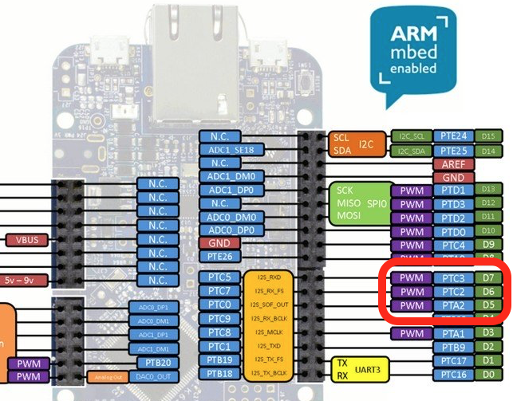

# Building the circuit

The first thing we want to do is build a basic circuit, where we connect the RGB LED and the PIR sensor to the development board.

## Finding suitable pins

For the circuit we need four digital pins. Three of these need to support pulse width modulation (PWM). Through PWM we can control the amount of current flowing through a circuit, and we can use this to dim the colours of the LED on one of the three RGB channels.

To find pins that you can use, look at the [platform page](https://developer.mbed.org/platforms/) for your board and find the pinout. The pinout defines the characteristics of the pins. For example, here is the pinout for the FRDM-K64F, where we can use D5, D6 and D7 as our PWM pins:

The pinout for the NXP FRDM-K64F, showing that pins D5, D6 and D7 can be used for PWM.

We also need a pin for the PIR sensor. This can be any digital pin, as long as it is not marked as UART (D0 and D1 on the pinout above). In this example, we can use pin D2.

**Note:** In general it's a good idea not to use any of the I2C and SPI pins for LEDs and basic sensors, as connectivity shields (like Wi-Fi) might need them.

## Hooking up the peripherals on a breadboard

Here is a diagram of hooking up the PIR sensor and the RGB LED to your board. Replace the pins D2, D5, D6 and D7 with the pins for your board. If you have a four-pin RGB LED, the LED has to be positioned so that the longest pin is the second from the left (hold it [like this](http://howtomechatronics.com/wp-content/uploads/2015/09/RGB-LED.png?28ea0f)).

**Note - common anode or common cathode LED:** Four pin RGB LEDs come in two different types: *common anode* and *common cathode*. If you have a common cathode LED, connect the second pin to `GND` instead of `3.3V`. If you are unsure, just try both circuits and see which one works.

**Note:** If you're unsure of the pins on the PIR sensor, and you have a sensor with a 'dome' on it: remove the dome. The pins are described on the PCB.

When you have connected everything, the circuit looks something like this:

