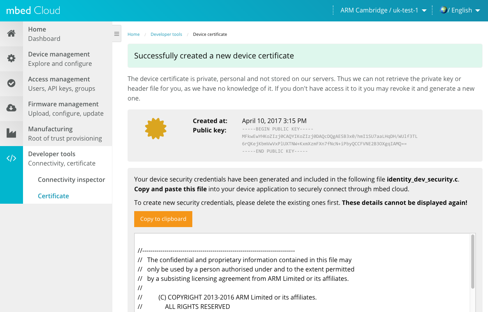

# Adding connectivity

Now that we built our basic circuit and wrote the code to control the circuit, we can start adding connectivity to the project. Part of the ARM mbed IoT Device Platform is mbed Device Connector, a unified solution to connect devices to the internet and communicate with them regardless of *how* these devices connect to the internet. There are libraries available for a variety of connectivity methods, including Ethernet, WiFi, 6LoWPAN, Thread and Cellular.

## Obtaining a device certificate

All data that goes from the device to mbed Device Connector (and vice-versa) is end-to-end encrypted by [mbed TLS](https://tls.mbed.org). To set up secure communications we need a security certificate. We can get one from the mbed Device Connector website:

1. Go to the [mbed Device Connector homepage](https://connector.mbed.com) and click *Sign in to get connected*.
1. If prompted for your login credentials, use your mbed developer account (the same account you use to log into the mbed Online Compiler).
1. Go to *My Devices* > *Security Credentials*.
1. Click *Get my security credentials*.
1. Copy the contents of the gray box. This is your certificate.




Now go back to the online compiler, and create a new file ``security.h`` in the ``source`` directory. Paste the certificate in this file.

## Adding connectivity to the board

### Ethernet

If you have a development board that connects over Ethernet, just plug in an Ethernet cable. We’re assuming that the network has DHCP enabled and the firewall does not block connections to http://connector.mbed.com.

### ESP8266 WiFi module

To wire the ESP8266 module up to your development board, look at the [ESP8266 Cookbook page](https://developer.mbed.org/users/4180_1/notebook/using-the-esp8266-with-the-mbed-lpc1768/). In general this means hooking up the ESP8266 TX pin up to `D0` and the ESP8266 RX pin up to `D1` on your development board.

#### ESP8266 on NUCLEO boards

On the NUCLEO boards pins `D0` and `D1` are used for serial communication with the computer. Use pins `D8` and `D2` instead.

### 6LoWPAN

First connect your 6LoWPAN gateway to an IPv6-enabled network by following the steps under 'Gateway Configuration' on [this page](https://github.com/ARMmbed/mbed-client-example-6lowpan#gateway-configuration). Then just click the 6LoWPAN shield on top of your development board.

## Adding libraries

For the device and mbed Device Connector to talk we need the [mbed Client library](https://docs.mbed.com/docs/mbed-client-guide/en/latest/). This library is already included in mbed OS, and is very powerful, but can also be daunting for new users. In this example we'll use an additional library built on top of mbed Client: SimpleClient. This library is designed to easily expose variables and resources to the cloud.

We will also use [EasyConnect](https://github.com/ARMmbed/easy-connect) to handle connectivity.

To add these libraries to your project go back to the online compiler, and:

1. Right click on your program in the tree and select *Import Library > From URL*.
1. Under 'Source URL' enter: ``https://github.com/armmbed/easy-connect``.
1. Do **not** tick 'Update all sub-libraries to the latest version'.
1. Click *Import*.
1. Again, right click on your program and select *Import Library > From URL*.
1. Under 'Source URL' enter: ``https://developer.mbed.org/teams/sandbox/code/simple-mbed-client/``.
1. Click *Import*.

## Adding libraries with mbed CLI

If you are using mbed CLI, run the following commands to add the libraries:

```bash
$ mbed add easy-connect
$ mbed add http://developer.mbed.org/teams/sandbox/code/simple-mbed-client/
```

## Updating configuration

We need to tell EasyConnect which connectivity method to use. Open ``mbed_app.json`` and locate the `network-interface` field. Change the `value` to the connectivity method used:

```json
/* mbed_app.json */

/* snip */

        "network-interface":{
            "help": "options are ETHERNET,WIFI_ESP8266,MESH_LOWPAN_ND,MESH_THREAD",
            "value": "ETHERNET"
        },
        "esp8266-tx": {
            "help": "Pin used as TX (connects to ESP8266 RX)",
            "value": "D1"
        },
        "esp8266-rx": {
            "help": "Pin used as RX (connects to ESP8266 TX)",
            "value": "D0"
        },
        "esp8266-ssid": {
            "value": "\"SSID\""
        },
        "esp8266-password": {
            "value": "\"Password\""
        },
        "esp8266-debug": {
            "value": true
        }
    }

/* snip */
```

If you are using WiFi, also set your WiFi SSID and your password. If you used different pins than `D0`/`D1`, update the pin names too.

## Writing code

We need to add some code to the application so it connects to the internet and sets up a connection to mbed Device Connector.

Replace ``main.cpp`` with:

```cpp
#include "mbed.h"
#include "led.h"        // Abstracts away the differens between the LED types
#include "security.h"   // Security configuration
#include "easy-connect.h"
#include "simple-mbed-client.h"

EventQueue eventQueue;  // An event queue
Thread eventThread;     // An RTOS thread to process events in

SimpleMbedClient client;

// PIR sensor acts as an interrupt - signals us whenever it goes high (or low)
InterruptIn pir(PIR_PIN);   // This pin value comes out mbed_app.json


// YOUR CODE HERE
void pir_rise() { }
// END OF YOUR CODE HERE

// Use the built-in LED as a status LED
DigitalOut statusLed(LED1);
int        statusLedBlinkId;    // Callback ID
void blink_builtin_led() {
  statusLed = !statusLed;
}

void registered() {
  // When we registered with mbed Device Connector, blink faster
  eventQueue.cancel(statusLedBlinkId);

  statusLedBlinkId = eventQueue.call_every(300, &blink_builtin_led);
}

int main(int, char**) {
  // Using an event queue is a very useful abstraction around many microcontroller 'problems', like dealing with ISRs
  // see https://developer.mbed.org/blog/entry/Simplify-your-code-with-mbed-events/
  eventThread.start(callback(&eventQueue, &EventQueue::dispatch_forever));

  // Blink the built-in LED every 1000ms. After registering we'll blink every 300ms.
  statusLedBlinkId = eventQueue.call_every(1000, &blink_builtin_led);

  // Disable the LED
  setRgbColor(0.0f, 0.0f, 0.0f);

  // The PIR sensor uses interrupts, no need to poll
  pir.rise(eventQueue.event(&pir_rise));

  NetworkInterface* network = easy_connect(true);
  if (!network) {
    printf("Connect to internet failed... See serial output.\r\n");
    return 1;
  }

  struct MbedClientOptions options = client.get_default_options();
  options.DeviceType = "light-system";
  if (!client.setup(options, network)) {
    printf("Setting up mbed_client failed...\r\n");
    return 1;
  }

  client.on_registered(eventQueue.event(&registered));

  // We can just let the main thread end here, no need to busy-loop
}
```

The code sample above does not do much, except for setting up the connection. We can now define some logic for this program:

1. The color of the LED should be configurable.
1. The period between the moment of motion detection to the moment lights go out should be configurable.
1. There should be a permanent-on mode for the lights.
1. We should notify mbed Device Connector whenever we detect movement.

We can implement these actions by defining resources. Resources are actions that can be read or written from the cloud, and which we can subscribe to (when a resource changes) on both device and cloud side. Resources are addressable under a path and an access modifier (for example, only write allowed). Let's define a resource for each of our actions:

* led/0/color - the color of the LED.
* led/0/timeout - the timeout (in seconds) after detection; lights are disabled when this period ends.
* led/0/permanent_status - whether we should have the lights permanently on (or off).
* pir/0/count - the number of times the PIR sensor was triggered. Read only, and should allow notifications.

We can use SimpleClient to define these resources and attach actions to each resource.

Replace the following section in ``main.cpp``:

```cpp
// YOUR CODE HERE
void pir_rise() { }
// END OF YOUR CODE HERE
```

with (comments inline):

```cpp
// Fwd declaration
void putLightsOn();
void colorChanged(int newColor);

// Variable that holds whether the light is on because the PIR sensor triggered (and timeout didn't happen yet)
bool ledOnBecauseOfPir = false;

// Timeout based on led/0/timeout, disables the light after a set interval
Timeout pirTimeout;

// Permanent statuses (set by led/0/permanent_status)
#define STATUS_NONE     0
#define STATUS_ON       1
#define STATUS_OFF      2

// clear the lights
void putLightsOff() {
  setRgbColor(0.0f, 0.0f, 0.0f);
}

// Status changes
void statusChanged(int newStatus) {
  switch (newStatus) {
    case STATUS_ON: // Permanently on? OK.
      putLightsOn();
      break;
    case STATUS_NONE: // Otherwise listen to PIR sensor
    case STATUS_OFF:  // Or be off forever
      putLightsOff();
      break;
  }
}

// Here are our resources:
// We encode color in 3 bytes [R, G, B] and put it in an integer by providing the color as an hex value (default color: green)
SimpleResourceInt ledColor = client.define_resource("led/0/color", 0x00ff00, &colorChanged);
SimpleResourceInt ledTimeout = client.define_resource("led/0/timeout", 5);
SimpleResourceInt ledStatus = client.define_resource("led/0/permanent_status", STATUS_NONE, &statusChanged);
SimpleResourceInt pirCount = client.define_resource("pir/0/count", 0, M2MBase::GET_ALLOWED);

// As said above, color is encoded in three bytes
void putLightsOn() {
  // parse the individual channels
  int redCh   = ledColor >> 16 & 0xff;
  int greenCh = ledColor >> 8 & 0xff;
  int blueCh  = ledColor & 0xff;

  // our color is 0..255, but we need a float between 0..1, cast it.
  float red = static_cast<float>(redCh) / 255.0f;
  float green = static_cast<float>(greenCh) / 255.0f;
  float blue = static_cast<float>(blueCh) / 255.0f;
  setRgbColor(red, green, blue);
}

// Color updated from the cloud,
// if the LED is on because of the PIR, or if the LED is on permanently -> Set the color.
void colorChanged(int newColor) {
  if (ledOnBecauseOfPir || ledStatus == STATUS_ON) {
    putLightsOn();
  }
}

// Timeout (from led/0/timeout) happened after PIR sensor was triggered...
void onPirTimeout() {
  // if we're not permanent on
  if (ledStatus != STATUS_ON) {
    // clear the lights
    putLightsOff();

    ledOnBecauseOfPir = false;
  }
}

// When the PIR sensor fires...
void pir_rise() {
  // Update the resource
  pirCount = pirCount + 1;

  // Permanent off? Don't put the lights on...
  if (ledStatus == STATUS_OFF) return;

  // Otherwise do it!
  ledOnBecauseOfPir = true;
  putLightsOn();

  // And attach the timeout
  pirTimeout.attach(eventQueue.event(&onPirTimeout), static_cast<float>(ledTimeout));
}
```

When you compile and flash this program, you'll see that when you wave your hand in front of the PIR sensor the color of the LED changes to green, and the LED always goes off after 5 seconds.

When the connection to mbed Device Connector is created, the onboard LED will blink faster. We can now control this device from the cloud.

<span class="notes">**Note:** No connection? [Inspect the logs on the device](https://developer.mbed.org/handbook/SerialPC#host-interface-and-terminal-applications).</span>

