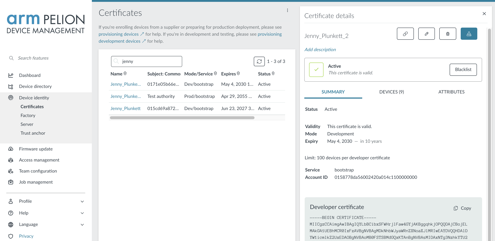

# Adding connectivity

Now that you've built the basic circuit and written the code to control that circuit, you can add connectivity to the project. Part of Arm's IoT Platform is Pelion Device Management, a unified solution to connect devices to the internet and communicate with them, regardless of *how* these devices connect to the internet. Libraries are available for a variety of connectivity methods, including Ethernet, Wi-Fi and cellular. You also can add new connectivity methods with the [unified networking APIs](https://os.mbed.com/docs/mbed-os/latest/apis/network-socket.html) in Mbed OS.

## Obtaining a device certificate

[Mbed TLS](https://tls.mbed.org) encrypts all data that goes from the device to Device Management (and from Device Management to the device). You need a security certificate to set up secure communication, which you can get from the Device Management Portal:

1. Go to the [Device Management Portal](https://portal.mbedcloud.com/), and sign in.
1. Select **Device identity** > **Certificates**.
1. Click **New certificate** > **Create a developer certificate**.
1. Enter a name for the certificate, and click **Create certificate**.
1. Go to **Device identity** > **Certificates** again.
1. Click on your new certificate.
1. Click **Download developer C file**. Your certificate file downloads.

    <span class="images"></span>

1. Copy the file (named `mbed_cloud_dev_credentials.c`) into the root directory.

## Adding connectivity to the board

### Built-in connectivity

This example assumes that the network has DHCP enabled and the firewall does not block connections to *https://mbedcloud.com*.

If you have a development board that connects over Ethernet, just plug in an Ethernet cable. If you have a board that connects over Wi-Fi, more actions are required.

**Setting the Wi-Fi credentials**

If you're using Wi-Fi, you'll need to set your Wi-Fi SSID and Password. Open `mbed_app.json` and locate the section that mentions `nsapi.default-wifi`:

```json
/* mbed_app.json */

/* snip */

            "nsapi.default-wifi-security"       : "WPA_WPA2",
            "nsapi.default-wifi-ssid"           : "\"SSID\"",
            "nsapi.default-wifi-password"       : "\"Password\""

/* snip */
```

Update these to reflect your Wi-Fi network.

### No built-in connectivity

If your board does not have built-in connectivity, or when you want to use a different connectivity module (such as an external Wi-Fi module) you need to:

1. Add the driver for the module to your project.
1. Replace the call to `NetworkInterface::get_default_instance()` with a call to the driver.

More information on the networking API, and a list of drivers are available in the [IP Networking section](https://os.mbed.com/docs/latest/reference/ip-networking.html) of the Mbed OS documentation.

## Adding libraries with Mbed CLI

For the device and Device Management to talk, you need the [Device Management Client library](https://cloud.mbed.com/docs/latest/mbed-cloud-client/index.html). This is a cross-platform library that runs on Mbed OS and Linux and that you can port to other RTOSes to expose variables and resources to the cloud.

These libraries are already in the project (see the `.lib` files in the project directory).

## Writing code

### Setting up a connection

You need to add some code to the application, so it connects to the internet and sets up a connection to Device Management. The following code is adapted from the [mbed-os-example-pelion](https://github.com/ARMmbed/mbed-os-example-pelion/) Mbed Cloud Client example.

Replace `lighting-system-firmware/source/main.cpp` with:

```cpp
#include "mbed-cloud-client/MbedCloudClient.h" // Required for new MbedCloudClient()
#include "factory_configurator_client.h"       // Required for fcc_* functions and FCC_* defines
#include "m2mresource.h"                       // Required for M2MResource
#include "key_config_manager.h"                // Required for kcm_factory_reset

#include "mbed.h"
#include "DeviceKey.h"
#include "kv_config.h"
#include "mbed-trace/mbed_trace.h"             // Required for mbed_trace_*
#include "led.h"                               // Abstracts away the differences between the LED type

// Pointers to the resources that will be created in `main`.
static MbedCloudClient *cloud_client;
static bool cloud_client_running = true;
static NetworkInterface *network = NULL;
static int error_count = 0;

// Fake entropy needed for non-TRNG boards. Suitable only for demo devices.
const uint8_t MBED_CLOUD_DEV_ENTROPY[] = { 0xf6, 0xd6, 0xc0, 0x09, 0x9e, 0x6e, 0xf2, 0x37, 0xdc, 0x29, 0x88, 0xf1, 0x57, 0x32, 0x7d, 0xde, 0xac, 0xb3, 0x99, 0x8c, 0xb9, 0x11, 0x35, 0x18, 0xeb, 0x48, 0x29, 0x03, 0x6a, 0x94, 0x6d, 0xe8, 0x40, 0xc0, 0x28, 0xcc, 0xe4, 0x04, 0xc3, 0x1f, 0x4b, 0xc2, 0xe0, 0x68, 0xa0, 0x93, 0xe6, 0x3a };
const int MAX_ERROR_COUNT = 5;

// The PIR sensor/user button acts as an interrupt - signals us whenever it goes high (or low)
InterruptIn sensor(PIR_OR_BTN);   // This pin value comes out mbed_app.json

// Resource declarations, they're assigned a value in `main`.
static M2MResource* ledColor;
static M2MResource* ledStatus;
static M2MResource* ledTimeout;
static M2MResource* sensorCount;
static M2MResource* deregisterClient;
static SocketAddress sa;

EventQueue eventQueue(32 * EVENTS_EVENT_SIZE);
Thread t;

// Variable that holds whether the light is on because the PIR sensor/user button is triggered (and timeout didn't happen yet)
bool ledOnBecauseOfSensor = false;

// Timeout based on led/0/timeout, disables the light after a set interval
Timeout sensorTimeout;

// // Permanent statuses (set by led/0/permanent_status)
enum PermanentStatus {
    STATUS_NONE = 0,
    STATUS_ON   = 1,
    STATUS_OFF  = 2
};

// clear the lights
void putLightsOff() {
    setRgbColor(0.0f, 0.0f, 0.0f);
}

// As said above, color is encoded in three bytes
void putLightsOn() {
    int color = (int)ledColor->get_value_int();

    // parse the individual channels
    int redCh   = color >> 16 & 0xff;
    int greenCh = color >> 8 & 0xff;
    int blueCh  = color & 0xff;

    // our color is 0..255, but we need a float between 0..1, cast it.
    float red = static_cast<float>(redCh) / 255.0f;
    float green = static_cast<float>(greenCh) / 255.0f;
    float blue = static_cast<float>(blueCh) / 255.0f;
    setRgbColor(red, green, blue);
}

// Color updated from the cloud,
// if the LED is on because of the PIR/user button, or if the LED is on permanently -> Set the color.
void colorChanged(const char* /*object_name*/) {
    int status = (int)ledStatus->get_value_int();

    if (ledOnBecauseOfSensor || status == STATUS_ON) {
        putLightsOn();
    }
}

// Status changes from the cloud
void statusChanged(const char* /*object_name*/) {
    int newStatus = (int)ledStatus->get_value_int();

    switch (newStatus) {
        case STATUS_ON: // Permanently on? OK.
            putLightsOn();
            break;
        case STATUS_NONE: // Otherwise listen to PIR sensor/user button
        case STATUS_OFF:  // Or be off forever
            putLightsOff();
            break;
    }
}

// Timeout (from led/0/timeout) happened after PIR sensor/user button was triggered...
void onSensorTimeout() {
  // if we're not permanent on
    if ((int)ledStatus->get_value_int() != STATUS_ON) {
        // clear the lights
        putLightsOff();

        ledOnBecauseOfSensor = false;
    }
}

// When the PIR sensor/user button fires...
void sensor_rise() {
    // Update the resource
    sensorCount->set_value((int)sensorCount->get_value_int() + 1);

    // Permanent off? Don't put the lights on...
    if ((int)ledStatus->get_value_int() == STATUS_OFF) return;

    // Otherwise do it!
    ledOnBecauseOfSensor = true;
    putLightsOn();

    // And attach the timeout
    std::chrono::seconds timeout{ledTimeout->get_value_int()};
    sensorTimeout.attach(eventQueue.event(&onSensorTimeout), timeout);
}

// Use the built-in LED as a status LED
DigitalOut statusLed(LED1);
int        statusLedBlinkId;    // Callback ID
void blink_builtin_led() {
    statusLed = !statusLed;
}

void print_client_ids(void)
{
    printf("Account ID: %s\n", cloud_client->endpoint_info()->account_id.c_str());
    printf("Endpoint name: %s\n", cloud_client->endpoint_info()->internal_endpoint_name.c_str());
    printf("Device ID: %s\n\n", cloud_client->endpoint_info()->endpoint_name.c_str());
}

void deregister_client(void)
{
    printf("Unregistering and disconnecting from the network.\n");
    cloud_client->close();
}

void deregister(void* /*arguments*/)
{
    printf("POST deregister executed\n");
    deregisterClient->send_delayed_post_response();

    deregister_client();
}

void client_registered(void) {
    // When we registered with Pelion Device Management, blink faster
    eventQueue.cancel(statusLedBlinkId);

    statusLedBlinkId = eventQueue.call_every(300ms, &blink_builtin_led);

    printf("Client registered.\n");
    print_client_ids();
    error_count = 0;
}

void client_registration_updated(void)
{
    printf("Client registration updated.\n");
    error_count = 0;
}

void client_unregistered(void)
{
    printf("Client unregistered.\n");
    (void) network->disconnect();
    cloud_client_running = false;
}

void client_error(int err)
{
    printf("client_error(%d) -> %s\n", err, cloud_client->error_description());
    if (err == MbedCloudClient::ConnectNetworkError ||
        err == MbedCloudClient::ConnectDnsResolvingFailed ||
        err == MbedCloudClient::ConnectSecureConnectionFailed) {
        if(++error_count == MAX_ERROR_COUNT) {
            printf("Max error count %d reached, rebooting.\n\n", MAX_ERROR_COUNT);
            ThisThread::sleep_for(1s);
            NVIC_SystemReset();
        }
    }
}

int main(int, char**) {
    // Blink the built-in LED every 1000ms. After registering we'll blink every 300ms.
    statusLedBlinkId = eventQueue.call_every(1s, &blink_builtin_led);

    // Disable the LED
    setRgbColor(0.0f, 0.0f, 0.0f);

    // The PIR sensor/user button uses interrupts, no need to poll
    sensor.rise(eventQueue.event(&sensor_rise));

    int status;

    status = mbed_trace_init();
    if (status != 0) {
        printf("mbed_trace_init() failed with %d\n", status);
        return -1;
    }

    // Mount default kvstore
    printf("Application ready\n");
    status = kv_init_storage_config();
    if (status != MBED_SUCCESS) {
        printf("kv_init_storage_config() - failed, status %d\n", status);
        return -1;
    }

#if MBED_MAJOR_VERSION > 5
    // Initialize root of trust
    DeviceKey &devkey = DeviceKey::get_instance();
    devkey.generate_root_of_trust();
#endif

    // Connect with NetworkInterface
    printf("Connect to network\n");
    network = NetworkInterface::get_default_instance();
    if (network == NULL) {
        printf("Failed to get default NetworkInterface\n");
        return -1;
    }
    status = network->connect();
    if (status != NSAPI_ERROR_OK) {
        printf("NetworkInterface failed to connect with %d\n", status);
        return -1;
    }
    status = network->get_ip_address(&sa);
    if (status!=0) {
        printf("get_ip_address failed with %d\n", status);
        return -2;
    }
    printf("Network initialized, connected with IP %s\n\n", sa.get_ip_address());

    // Run developer flow
    printf("Start developer flow\n");
    status = fcc_init();
    if (status != FCC_STATUS_SUCCESS) {
        printf("fcc_init() failed with %d\n", status);
        return -1;
    }

    // Inject hardcoded entropy for the device. Suitable only for demo devices.
    (void) fcc_entropy_set(MBED_CLOUD_DEV_ENTROPY, sizeof(MBED_CLOUD_DEV_ENTROPY));
    status = fcc_developer_flow();
    if (status != FCC_STATUS_SUCCESS && status != FCC_STATUS_KCM_FILE_EXIST_ERROR && status != FCC_STATUS_CA_ERROR) {
        printf("fcc_developer_flow() failed with %d\n", status);
        return -1;
    }

    cloud_client = new MbedCloudClient(client_registered, client_unregistered, client_error);

    // Initialize client
    cloud_client->init();

    printf("Create resources\n");
    M2MObjectList m2m_obj_list;

    // Resource declarations
    ledColor = M2MInterfaceFactory::create_resource(m2m_obj_list, 3311, 0, 5706, M2MResourceInstance::INTEGER, M2MBase::GET_PUT_ALLOWED);
    // We encode color in 3 bytes [R, G, B] and put it in an integer by providing the color as an hex value (default color: green)
    if (ledColor->set_value(0x00ff00) != true) {
        printf("ledColor->set_value() failed\n");
        return -1;
    }
    if (ledColor->set_value_updated_function(colorChanged) != true) {
        printf("ledColor->set_value_updated_function() failed\n");
        return -1;
    }

    ledTimeout = M2MInterfaceFactory::create_resource(m2m_obj_list, 3311, 0, 5853, M2MResourceInstance::INTEGER, M2MBase::GET_PUT_ALLOWED);
    if (ledTimeout->set_value(5) != true) {
        printf("ledTimeout->set_value() failed\n");
        return -1;
    }

    ledStatus = M2MInterfaceFactory::create_resource(m2m_obj_list, 3311, 0, 5850, M2MResourceInstance::INTEGER, M2MBase::GET_PUT_ALLOWED);
    if (ledStatus->set_value(STATUS_NONE) != true) {
        printf("ledStatus->set_value() failed\n");
        return -1;
    }
    if (ledStatus->set_value_updated_function(statusChanged) != true) {
        printf("ledStatus->set_value_updated_function() failed\n");
        return -1;
    }

    sensorCount = M2MInterfaceFactory::create_resource(m2m_obj_list, 3201, 0, 5700, M2MResourceInstance::INTEGER, M2MBase::GET_ALLOWED);
    if (sensorCount->set_value(0) != true) {
        printf("sensorCount->set_value() failed\n");
        return -1;
    }

    // POST resource 5000/0/1 to trigger deregister.
    deregisterClient = M2MInterfaceFactory::create_resource(m2m_obj_list, 5000, 0, 1, M2MResourceInstance::INTEGER, M2MBase::POST_ALLOWED);
    deregisterClient->set_delayed_response(true);
    if (deregisterClient->set_execute_function(deregister) != true) {
        printf("deregisterClient->set_execute_function() failed\n");
        return -1;
    }

    printf("Register Pelion Device Management Client\n\n");

    cloud_client->on_registration_updated(client_registration_updated);

    cloud_client->add_objects(m2m_obj_list);
    cloud_client->setup(network);

    t.start(callback(&eventQueue, &EventQueue::dispatch_forever));
}
```

### Resources

The code sample above sets up the connection and declares some resources. You define a resource for every part of the program that needs to be available from the cloud:

- The color and status of the LED should be configurable.
- The period between the moment of motion detection to the moment lights go out should be configurable.
- There should be a permanent-on mode for the lights.
- You should notify Device Management whenever you detect movement.

Think of resources as pieces of information the device makes available. You can read or write to them from the cloud, and the device can use a resource's value to determine the correct action to perform. You can reach a resource with a URI and access modifier (for example, only write allowed), and you can also subscribe to them, so you receive a notification when a resource changes.

This application defines the following resources (under `// Resource declarations`):

* `3311/0/5706` - the color of the LED.
* `3311/0/5853` - the timeout (in seconds) after detection; lights are disabled when this period ends.
* `3311/0/5850` - whether you should have the lights permanently on (or off).
* `3201/0/5700` - the number of times the PIR sensor/user button was triggered. Read only, and should allow notifications.

You can use the `create_resource` function to define extra resources and attach actions to each resource.

When you compile and flash this program, you'll see that when you wave your hand in front of the PIR sensor or press the user button, the color of the LED changes to green, and the LED always turns off after 5 seconds.

When the connection to Device Management is created, the onboard LED blinks faster. You can now control this device from the cloud.

<span class="notes">**Note:** No connection? [Inspect the logs on the device](https://os.mbed.com/docs/mbed-os/latest/program-setup/serial-communication.html). Use baud rate 115200 to communicate with your device.</span>

<span class="notes">**Note:** If you receive an `fcc_init` error, re-format the SD card (FAT).</span>
