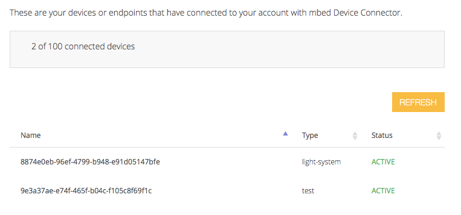
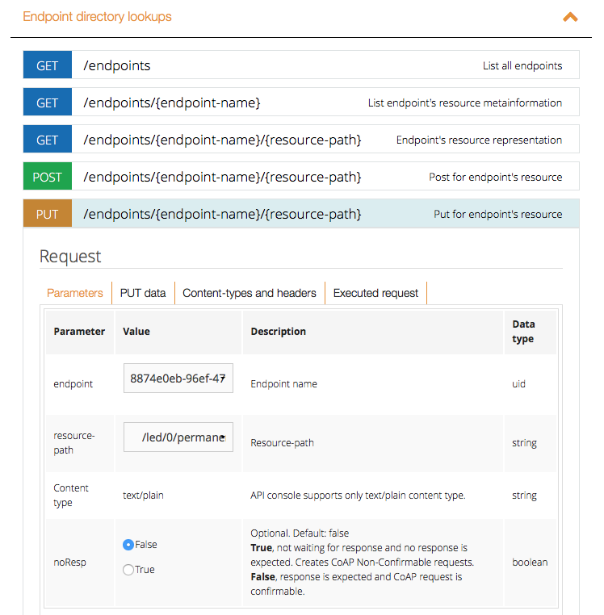
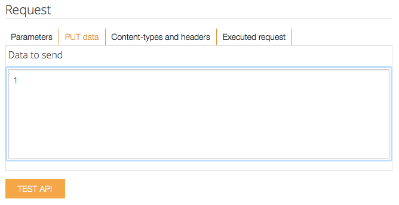

# Controlling the device from mbed Device Connector

At this moment the device is connected through mbed Device Connector. In the code sample that we gave in the previous section, we defined a number of resources using calls to `client.define_resource()`. These resources are automatically exposed to mbed Device Connector, from where you can read and write resources. Then, changes are automatically synced back to the device. That means that we already have a remote management interface for this device.

## Seeing the status of a device

Each device that you connect to mbed Device Connector has an endpoint name. This is a GUID (in the form of 8874e0eb-96ef-4799-b948-e91d05147bfe), which is the unique identifier of your device. If you don't know the endpoint name of your device, check the ``security.h`` file in the online compiler.

With the Endpoint Name we can check what the status of a device is in the mbed Device Connector online interface. The [endpoint](https://connector.mbed.com/#endpoints) page lists all devices associated with your account, with their current status.

**Tip:** The mbed Device Connector interface lists your devices by type. You can categorize devices by setting the device type in the application. See `options.DeviceType = "light-system";` in ``main.cpp``.




*The mbed Device Connector Connected Devices page, showing two connected devices: our light-system and another device.*

## Controlling the device

We created four resources before (see ``main.cpp``):

* led/0/color - the color of the LED, encoded as three bytes.
* led/0/timeout - the timeout (in seconds) after detection; lights are disabled when this period ends.
* led/0/permanent_status - whether we should have the lights permanently on (status 1), off (status 2), or should just let the PIR sensor figure it out (status 0).
* pir/0/count - the number of times the PIR sensor was triggered. Read only, and should show notifications.

These resources can be controlled through the mbed Device Connector web interface. For instance, when we write the value `1` to `led/0/permanent_status` the lights will go on indefinitely.

### Putting the lights on

To test this out, in mbed Device Connector go to *Device Connector* > *API Console*, and select *Endpoint directory lookups*. This will give you access to a management console where we can quickly test out interactions with resources.

To enable the lights:

1. Choose 'PUT'.
1. Select your endpoint and the resource path `/led/0/permanent_status`.




1. Switch to the *PUT data* tab and fill in `1`.
1. Press the *TEST API* button.




Now your lights will stay on until we change the status of `permanent_status` to 0 (listen to PIR sensor) or 2 (always off).

### Setting the color

We can control the color of the lights the same way. The color is encoded in an integer where we store three channels: red, green and blue. Each of the channels can have a value between 0 (off) and 255 (completely on).

To encode the value of a color, do this:

```js
red = 0;
green = 255;
blue = 255;

// alternatively: encode the color as a hex value, via encoded = 0x00ffff

encoded = (red << 16) + (green << 8) + blue;
// 65380
```

Use the API Console to write this value to resource `/led/0/color` and change the colour of the LED to turquoise.

### Other variables

We can also change the value of the timeout (in a real light system you probably want at least 30 seconds timeout) and read the number of times the PIR sensor triggered (in the GET tab).
