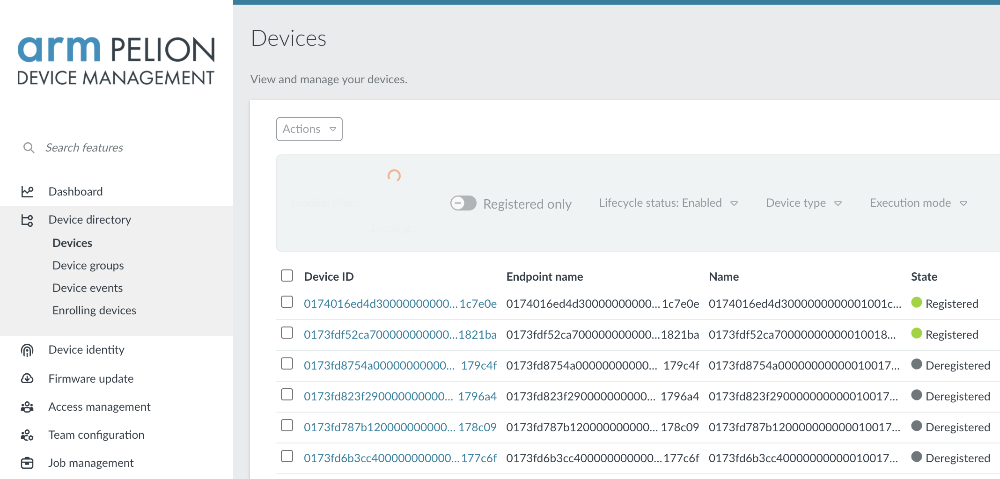
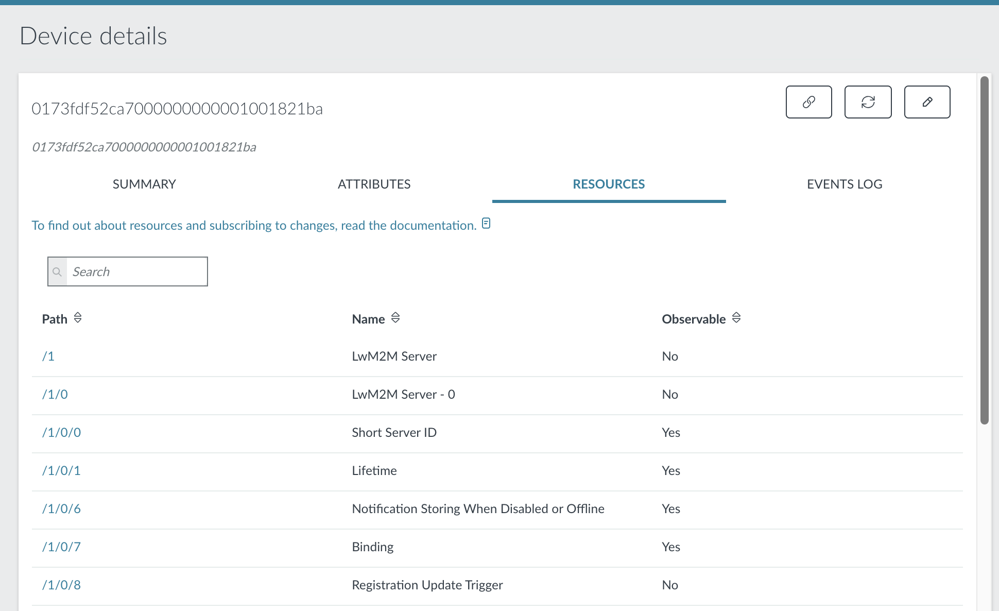
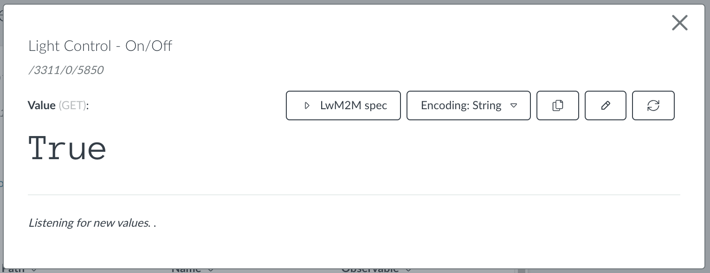

# Controlling the device with Pelion Device Management

Now, the device is connected through Device Management. In the code sample in the previous section, you defined resources using calls to `create_resource()`. These resources are automatically exposed to Device Management, from which you can read and write resources, and changes automatically sync with the device. That means that you already have a remote management interface for this device.

## Seeing the status of a device

Each device that you connect to Device Management has an endpoint name. This is a long string, which is the unique identifier of your device. If you don't know the endpoint name of your device, check the [serial output](https://os.mbed.com/docs/latest/tutorials/serial-comm.html) on your device for a line starting with 'Endpoint name'.

You need to know the endpoint's name to check the device's status in the Device Management Portal. The [Device directory](https://portal.mbedcloud.com/devices) page lists all devices associated with your account and their current status. Click the **Registered only** toggle to only see registered devices.

<span class="images"><span>The Device Management Portal device directory page, showing a list of registered and deregistered devices.</span></span>

## Controlling the device

You created four resources before (see `main.cpp`):

* `3311/0/5706` - the color of the LED, encoded as three bytes.
* `3311/0/5853` - the timeout (in seconds) after detection; lights are disabled when this period ends.
* `3311/0/5850` - whether we should have the lights permanently on (status 1) or off (status 2), or just let the PIR sensor figure it out (status 0).
* `3201/0/5700` - the number of times the PIR sensor was triggered. This is read only and shows notifications.

You can control these resources through the Device Management Portal. For instance, when you write the value `1` to `3311/0/5850`, the lights stay on indefinitely.

### Turning the lights on

To test this, click on your Device ID in the device directory in Device Management Portal. This gives you access to a management console where you can quickly test interactions with resources.

<span class="images"><span>These tables show the available resources on this device.</span></span>

To enable the lights:

1. Click **/3311/0/5850**.
1. Click **Edit**.
1. Click **Put**.
1. Enter value `1`.
1. Click **Send**.

    <span class="images"></span>

Now, your lights stay on until you change the status of this resource to 0 (listen to PIR sensor) or 2 (always off).

### Setting the color

You can control the color of the lights the same way. The color is encoded in an integer that stores three channels: red, green and blue. Each of the channels can have a value between 0 (off) and 255 (completely on).

To encode the value of a color:

```js
red = 0;
green = 255;
blue = 255;

// alternatively: encode the color as a hex value, via encoded = 0x00ffff

encoded = (red << 16) + (green << 8) + blue;
// 65380
```

Use the API Console to write this value to resource `/3311/0/5706` and change the color of the LED to turquoise.

### Other variables

You can also change the value of the timeout (in a real light system, you probably want at least 30 seconds) and read the number of times the PIR sensor triggered.
