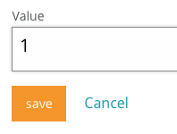

### Controlling the device from mbed Cloud

At this moment the device is connected through mbed Cloud. In the code sample that we gave in the previous section, we defined a number of resources using calls to `client.define_resource()`. These resources are automatically exposed to mbed Cloud, from where you can read and write resources, and changes are automatically synced back to the device. That means that we already have a remote management interface for this device.

#### Seeing the status of a device

Each device that you connect to mbed Cloud has an endpoint name. This is a long string, which is the unique identifier of your device. If you don't know the endpoint name of your device, check the [serial output](https://docs.mbed.com/docs/mbed-os-handbook/en/latest/debugging/printf/) on your device for a line starting with 'Device Identity'.

We need the know the endpoint's name to check the device's status in the mbed Cloud Portal. The [Connectivity Inspector](https://portal.mbedcloud.com/developer/connected) page lists all devices associated with your account, with their current status.

<span class="tips">**Tip:** The mbed Cloud interface lists your devices by type. You can categorize devices by setting the device type in the application running on the device. See the `endpoint-type` property in ``mbed_app.json``.</span>

<span class="images"><span>The mbed Cloud Portal connectivity inspector page, showing two connected devices: our light-system and another device.</span></span>


#### Controlling the device

We created four resources before (see ``main.cpp``):

* `led/0/color` - the color of the LED, encoded as three bytes.
* `led/0/timeout` - the timeout (in seconds) after detection; lights are disabled when this period ends.
* `led/0/permanent_status` - whether we should have the lights permanently on (status 1) or off (status 2), or just let the PIR sensor figure it out (status 0).
* `pir/0/count` - the number of times the PIR sensor was triggered. Read only, and should show notifications.

These resources can be controlled through the mbed Cloud Portal. For instance, when we write the value `1` to `led/0/permanent_status` the lights will stay on indefinitely.

##### Turning the lights on

To test this out, in mbed Cloud Portal go to *Developer Tools* > *Connectivity inspector*, and click on your device. This gives you access to a management console where you can quickly test interactions with resources.

<span class="images"><span>Showing the available resources on this device</span></span>

To enable the lights:

1. Click on */led/0/permanent_status*.
1. Click on *Edit*.

    **Todo: add a screenshot here when this UI is added to mbed Cloud Portal**

1. Enter `1`.
1. Click *Save*.

    <span class="images"></span>

Now your lights will stay on until you change the status of `permanent_status` to 0 (listen to PIR sensor) or 2 (always off).

##### Setting the color

We can control the color of the lights the same way. The color is encoded in an integer where we store three channels: red, green and blue. Each of the channels can have a value between 0 (off) and 255 (completely on).

To encode the value of a color:

```js
red = 0;
green = 255;
blue = 255;

// alternatively: encode the color as a hex value, via encoded = 0x00ffff

encoded = (red << 16) + (green << 8) + blue;
// 65380
```

Use the API Console to write this value to resource `/led/0/color` and change the color of the LED to turquoise.

##### Other variables

We can also change the value of the timeout (in a real light system you probably want at least 30 seconds) and read the number of times the PIR sensor triggered (in the GET tab).
