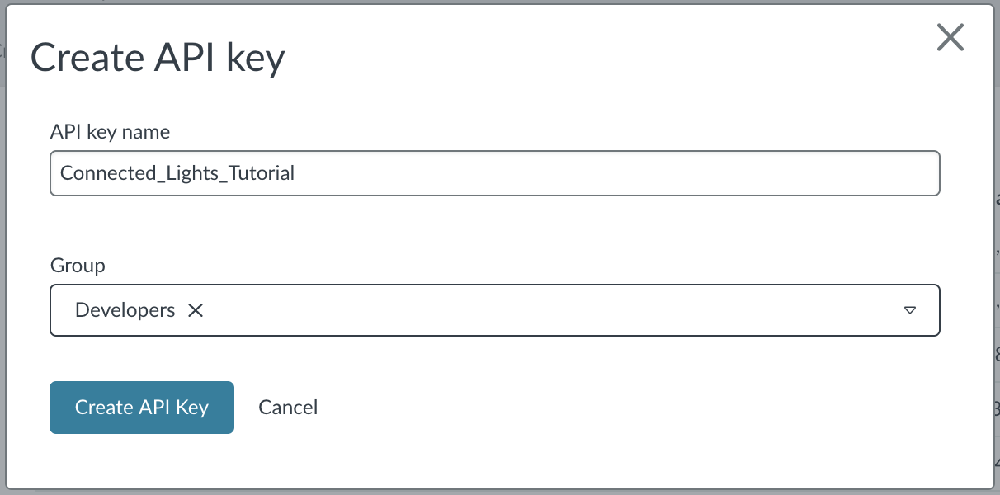

# Using the Device Management API

The Device Management Portal that you used in the previous section is a wrapper around the Device Management API. Through this API, you can connect any app to any device. You can use this API to build an app that allows you to control any of the lighting systems that you deploy in your house or office.

## Obtaining an application key

To talk to the API, you need to authenticate using an application key. To create a new application key, go to the [Access management](https://portal.mbedcloud.com/access/keys/) page in the Device Management Portal.

Click **New access key** to create a new access key, and name it.

<span class="images"></span>

## Testing the application key

You can quickly test if the application key works by sending a call to the API to query for all the devices. To retrieve a list of all devices, make a GET request to `https://api.us-east-1.mbedcloud.com/v3/devices`. You need to send an authorization header with this request:

```
Authorization: Bearer <your_application_key>
```

You can make this request with any request library, but if you're using curl, use the following command:

```
curl -v -H "Authorization: Bearer <your_application_key>" https://api.us-east-1.mbedcloud.com/v3/devices
```

It will return something like this:
```
{
  "object": "list",
  "limit": 50,
  "after": null,
  "order": "ASC",
  "has_more": true,
  "data": [
    {
      "account_id": "00000000000000000000000000000000",
      "auto_update": false,
      "bootstrap_expiration_date": null,
      "bootstrapped_timestamp": "2017-09-26T16:52:21.886181Z",
      "ca_id": "mbed Client Service",
      "component_attributes": {},
      "connector_expiration_date": null,
      "created_at": "2017-09-26T16:52:21.886008Z",
      "custom_attributes": {},
      "deployed_state": "development",
      "deployment": "",
      "description": "",
      "device_class": "",
      "device_execution_mode": 5,
      "device_key": "00:00:00:00:00:00:00:00:00:00:00:00:00:00:00:00:00:00:00:00:00:00:00:00:00:00:00:00:00:00:00:00",
      "endpoint_name": "gen_data_ep_2",
      "endpoint_type": "",
      "enrolment_list_timestamp": null,
      "etag": "2017-09-28T18:52:32.438990Z",
      "firmware_checksum": "",
      "groups": [],
      "host_gateway": "",
      "id": "00000000000000000000000000000000",
      "issuer_fingerprint": null,
      "last_operator_suspended_category": null,
      "last_operator_suspended_description": null,
      "last_operator_suspended_updated_at": null,
      "last_system_suspended_category": null,
      "last_system_suspended_description": null,
      "last_system_suspended_updated_at": null,
      "lifecycle_status": "enabled",
      "manifest": "",
      "manifest_timestamp": null,
      "mechanism": "connector",
      "mechanism_url": "",
      "name": "00000000-0000-0000-0000-000000000000",
      "object": "device",
      "operator_suspended": false,
      "serial_number": "2",
      "state": "deregistered",
      "system_suspended": false,
      "updated_at": "2017-09-28T18:52:32.438990Z",
      "vendor_id": ""
    }
  ]
}
```

<span class="notes">**Note:** Please see the official [Service API documentation](https://www.pelion.com/docs/device-management/current/service-api-references/service-api-documentation.html) for the Device Management Service API interface.</span>

## Integrating with a web application

With the Device Management API, you can read, write and control the resources available on the device. Using this API, you can integrate Device Management REST API calls into a web application to control the lights in this tutorial.

Please see the tutorial on [Building and deploying a web application using the Connect APIs](https://www.pelion.com/docs/device-management/current/integrate-web-app/building-and-deploying-a-web-application-using-the-connect-apis.html) using the Resource IDs defined in this tutorial (`3311/0/5706`, `3311/0/5853`, `3311/0/5850`, and `3201/0/5700`).
