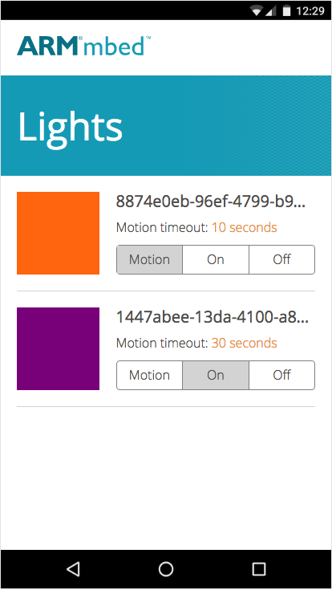

# Bringing it all together

We’ve already built almost all of the pieces required for our lighting system. We now have:

* The circuitry.
* The firmware.
* A connection to mbed Cloud.
* A way of talking from a node.js or Python app to the device.

We can now combine everything by building a web app that allows us to control the lights from anywhere in the world. For convenience we built a node.js mobile web app for you, which is located here: [ARMmbed/connected-lights](https://github.com/ARMmbed/connected-lights/tree/master/webapp). The web app has the following features:

* Lists all the lights under your account.
* Changes the status of the light (from motion sensing to on/off).
* Quickly changes colors.
* Gets notifications whenever the PIR sensor detects movement.

Here is a screenshot of the app running on an Android phone:




*Mobile interface with two lights connected. Tap the color to change it.*

By tapping on the endpoint name we can quickly rename the light to something more friendly (like “living room”), and by clicking on the color we can pick a new light color from a color wheel.

## Installing the application

To start the application, first download the application, either by:

1. Downloading the [application as a ZIP archive](https://github.com/ARMmbed/connected-lights/archive/master.zip).
1. Or by running `git clone https://github.com/armmbed/connected-lights` in your terminal.

Then open ``main.js`` and paste in your mbed Cloud Access Token on the first line. Next, open a terminal or the command prompt and navigate to the location where you extracted the application, and run:

```
$ cd connected-lights/webapp
$ npm install
$ node main.js
```

Open your web browser and go to http://localhost:5265 to see the application running.

## Konekuta

The web application is built on top of [Konekuta](https://github.com/armmbed/konekuta), a framework for building dynamic web applications on top of mbed Device Connector. Konekuta solves a number of common problems with building connected applications, including state syncing, going offline/online, handling errors, and updating the UI when devices connect or disconnect from mbed Cloud. Konekuta is open source and available on [GitHub](https://github.com/armmbed/konekuta).
