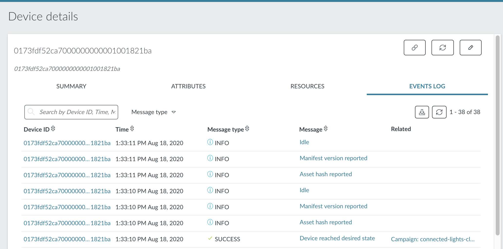

# Applying firmware updates to the device

One of the big features of Device Management is the ability to update devices through a firmware update over the air. This is not applicable when you're developing, but it is important when you have deployed thousands of devices in the field. Through the firmware update process, you can patch bugs and apply security updates.

Currently, your application sends a notification to the cloud every time the PIR sensor or user button is triggered. That is wasteful if someone is standing in front of the sensor. The lights are already on, but the sensor keeps firing, so the networking stack needs to wake up all the time. Modify the code, so it does not send events when the lights are already on.

**Updating Mbed CLI**

This step requires Mbed CLI version 1.8.2 or higher. To check your Mbed CLI version, run:

```
$ mbed --version
```

To update Mbed CLI, either use the installer for your platform or run:

```
$ pip install mbed-cli --upgrade
```

## Update certificates

To enable updates, you need to embed an update certificate into the firmware of your application. This verifies that the update came from a trusted source because all firmware images are signed with a private key. The update certificate also prevents incompatible firmware to be flashed on the device because the certificate contains information about the manufacturer, device class and device ID.

For development, you can use a self-signed certificate, but please note that this is not secure.

<span class="notes">**Note:** If you're deploying devices in the field, always use a certificate from a trusted certificate authority (CA). Instructions on how to use your own certificate are [in the manifest documentation](https://www.pelion.com/docs/device-management/current/updating-firmware/preparing-manifests.html).</span>

### Generating an update certificate

To create a new self-signed certificate, run:

```
$ mbed config -G CLOUD_SDK_API_KEY <YOUR_APPLICATION_KEY>

$ mbed dm init -d "domain.com" --model-name "lighting-system-2000" --force -q
```

**Note:** Make sure to replace `YOUR_APPLICATION_KEY` with the application key you created earlier.

Now that the update certificate is in place, you can build and flash the application as you normally do.

## Creating the updated firmware

When your board is back online in Device Management, you can then prepare an update. Open `main.cpp`, and change the `sensor_rise()` function to:

```cpp
// When the PIR sensor/user button fires...
void sensor_rise() {
    // Update the resource if the light is not on yet (because of the PIR sensor/user button)
    if (!ledOnBecauseOfSensor) {
        sensorCount->set_value((int)sensorCount->get_value_int() + 1);
    }

    // Permanent off? Don't put the lights on...
    if ((int)ledStatus->get_value_int() == STATUS_OFF) return;

    // Otherwise do it!
    ledOnBecauseOfSensor = true;
    putLightsOn();

    // And attach the timeout
    std::chrono::seconds timeout{ledTimeout->get_value_int()};
    sensorTimeout.attach(eventQueue.event(&onSensorTimeout), timeout);
}
```

Then rebuild the application, but do not flash the binary to your development board:

```
$ mbed compile -t GCC_ARM -m YOUR_BOARD_NAME
```

## Updating the device

An application that is managed by Device Management consists of two parts. Your application and a [bootloader](https://github.com/armmbed/mbed-bootloader). The bootloader verifies the firmware on the device and can swap firmware for other firmware. These two applications are automatically combined into a single binary when building. However, for firmware updates we want the binary without the bootloader. It's located in your build folder as `connected-lights-cloud_application.bin`.

We can push this new application to your development board through Device Management. Mbed CLI can both sign the update - using the private key generated earlier - and upload it to Device Management in a single command.

Run:

```
$ mbed dm update device -D YOUR_ENDPOINT_NAME
```

Replace `YOUR_ENDPOINT_NAME` with the endpoint name in Device Management.

Inspect the logs on the device (via a serial monitor) to see the firmware update progress. (This may take a few minutes.) It looks similar to:

```
Mbed Bootloader
[DBG ] Update active firmware
[DBG ] Erase active application
[DBG ] Write header
[DBG ] Copy application
[DBG ] Verify application
[DBG ] New active firmware is valid
booting...
```

When the download completes, the firmware is verified. If everything is OK, the firmware update is applied. Your device is now running the latest version of the application.

You can also verify the firmware update was successful through the **Events Log** tab on the device page in the Device Management portal.

<span class="images"><span>The Events Log page for the device, showing that the firmware update was successful and the "device reached desired state".</span></span>
