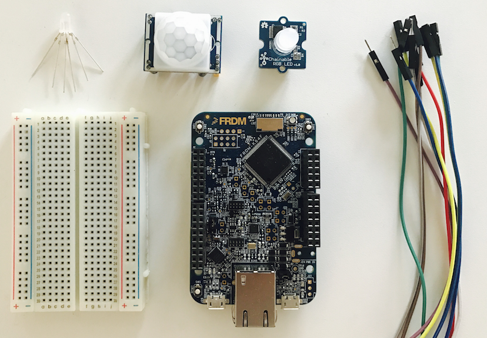

# Building an internet connected lighting system

In this tutorial we'll use the ARM mbed IoT Device Platform to build a complete connected lighting system that you can deploy in your house or office. The system consists of one (or more) extra-bright RGB LEDs hooked up to an mbed OS development board. The lights can be turned on or off by a motion sensor, but are also connected to the internet, so you can change their color. The system uses mbed Device Connector to connect to the internet, and is secured end-to-end.

We'll go over all the steps required to build the hardware, the cloud integration, and the application. At the end of the tutorial you'll have a firm understanding of building complete connected IoT solutions on the mbed IoT Device Platform. You'll also have a cool light.

## Requirements

We need the following hardware:

* A [development board](https://developer.mbed.org/platforms/?software=16) capable of running mbed OS.
* A way of connecting to the internet, either:
    * Via Ethernet, by using a development board with an Ethernet connection.
    * Via WiFi, by using an [ESP8266 WiFi module](https://developer.mbed.org/teams/ESP8266/).
    * Via 6LoWPAN, by using a [6LoWPAN gateway](https://firefly-iot.com/product/firefly-6lowpan-gateway-2-4ghz/) and a [6LoWPAN shield](https://firefly-iot.com/product/firefly-arduino-shield-2-4ghz/).
* A breadboard, to hook up all components.
* A PIR sensor to detect motion.
* An RGB LED - preferably an extra-bright one.
    * For a better effect you can also use a [Grove Chainable LED](http://wiki.seeed.cc/Grove-Chainable_RGB_LED/).
    * After building the original application, you can easily swap out the LED for something [fancier](https://www.adafruit.com/product/1138).
* Some jumper wires. Both male-male and male-female.
* Resistors: 1x 100 Ohm, 2x 220 Ohm.

*Components required to build our lighting system. On the top: RGB LED, PIR sensor, ESP8266 WiFi module. On the bottom: breadboard, NXP FRDM-K64F, jumper wires.*

We also need an account on [developer.mbed.org](http://developer.mbed.org/), to access the online compiler and mbed Device Connector.
